# Dragon Battle

A small 2.5D top-down battle between two dragons, made for the Dexhigh Services Junior Unity Developer technical
assessment. You control SoulEater and fight TerrorBringer, an AI dragon with the same three abilities and cooldowns.

<p align="center">
  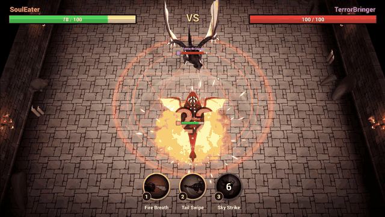
</p>

<p align="center">
  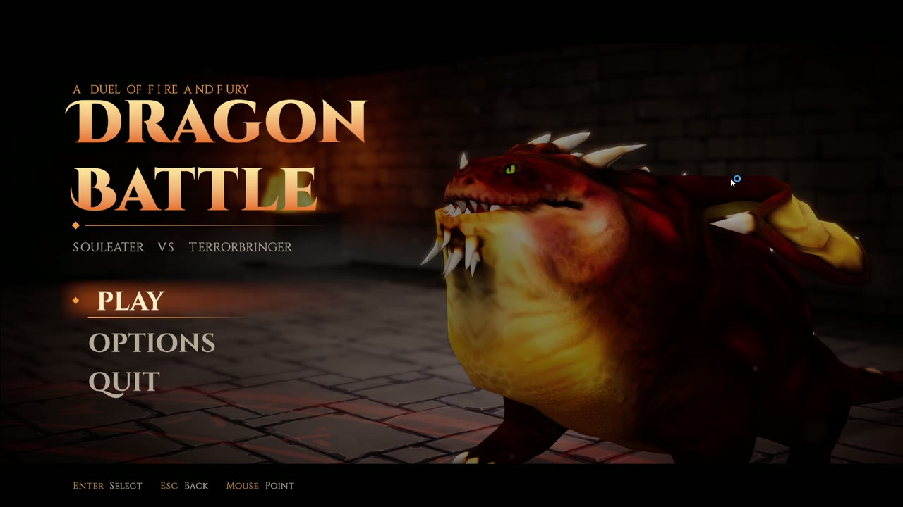
  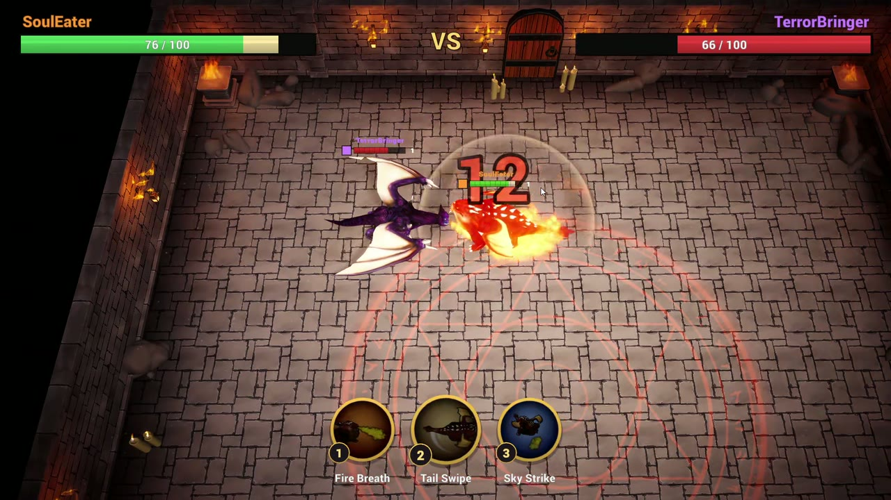
  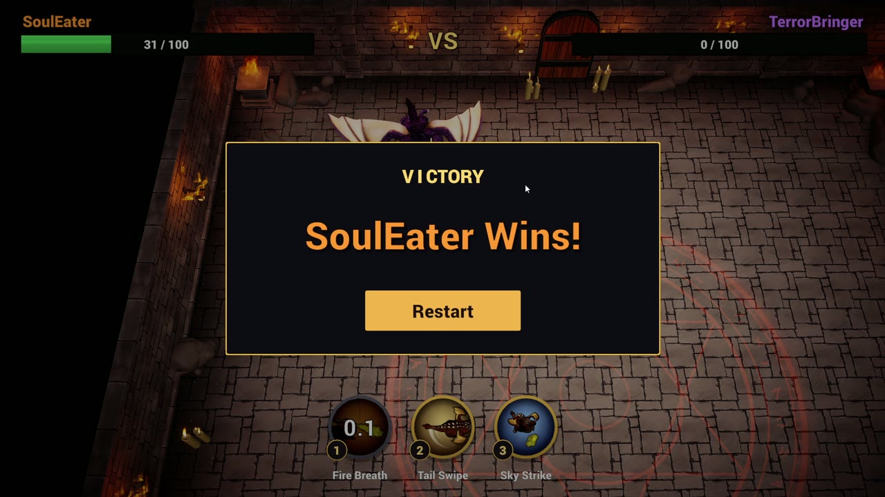
</p>

- **Unity version:** 6000.3.24f1 (Unity 6.3), Universal Render Pipeline
- **Platform:** Windows 64-bit
- **Scene:** `Assets/_Project/Scenes/Battle.unity`

## Controls

Movement uses **WASD** (not click-to-move). Movement is relative to the camera.

| Action | Keyboard | Gamepad |
|---|---|---|
| Move | W A S D | Left stick |
| Fire Breath | 1 (or Numpad 1) | X / Square |
| Tail Swipe | 2 (or Numpad 2) | A / Cross |
| Sky Strike | 3 (or Numpad 3) | Y / Triangle |
| Menu navigate / adjust option | Arrow keys or mouse | D-pad / left stick |
| Menu select | Enter or click | A / Cross |
| Menu back | Esc | B / Circle |
| Restart (Winner Screen) | Enter or click | A / Cross |
| Quit | Main Menu Quit, or Alt + F4 | |

## Gameplay

Both dragons have 100 HP. The first dragon to reach 0 HP loses, and the Winner Screen names the winner and offers a
Restart.

| Ability | Key | Damage | Cooldown | What it does |
|---|---|---|---|---|
| Fire Breath | 1 | 12 | 4 s | Breathes fire in a 70 degree cone up to 8 m in front of the dragon. Light knockback. |
| Tail Swipe | 2 | 9 | 2.5 s | Close-range sweep (4.5 m) with strong knockback. |
| Sky Strike | 3 | 22 | 10 s | Takes off, flies towards the enemy, fires a fireball that explodes in a 4 m radius, then lands. |

Each ability has its own animation, particle effect, cast sound and impact sound. Damage lands at a fixed point in
the attack animation, not on the key press, so hits line up with the visuals.

<table>
  <tr>
    <th>Fire Breath (1)</th>
    <th>Tail Swipe (2)</th>
    <th>Sky Strike (3)</th>
  </tr>
  <tr>
    <td>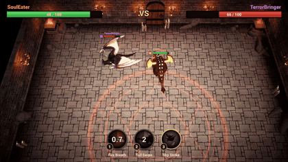</td>
    <td>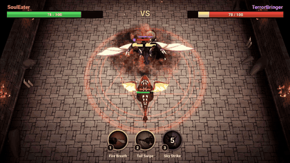</td>
    <td>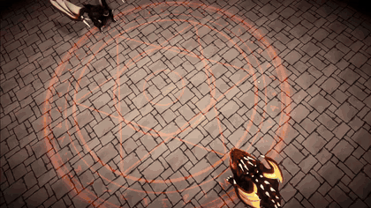</td>
  </tr>
  <tr>
    <td>Ranged cone of fire in front of the dragon.</td>
    <td>Close-range sweep that knocks the enemy back.</td>
    <td>Takes off, fires an exploding fireball from the air, then lands.</td>
  </tr>
</table>

### Enemy AI

`EnemyAI` is a small state machine with four states: **Idle, Chase, Attack, Dead**.

- **Idle:** waits briefly at the start of the round, and stops once the player is dead.
- **Chase:** moves into range of the next ability it wants to use. When close, it circles the player and changes
  direction every few seconds. While nothing is ready it keeps its distance.
- **Attack:** chooses by distance. Tail Swipe when close, Fire Breath at mid range (turning to face the player
  first), Sky Strike when the player is far away or when it has been on the ground for a while.
- **Dead:** stops all behaviour.

The AI uses the same `AbilityCaster` component and the same ability assets as the player, so its damage and
cooldowns are identical. Its tuning values (reaction delay, melee chance, circling, Sky Strike rest time) are exposed
in the Inspector on the `EnemyDragon` prefab.

<p align="center">
  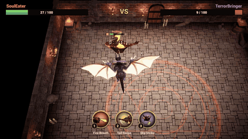
  <br>
  <em>TerrorBringer circles the player, then takes off and lands its own Sky Strike.</em>
</p>

### Feedback and UI

- Health bars for both dragons at the top of the screen, with a delayed trail that shows the size of each hit.
- Three ability icons at the bottom with a radial cooldown sweep and a countdown timer.
- Hit feedback: red flash on the dragon that was hit, floating damage numbers, hit particles, hit sounds, camera
  shake and physics knockback.
- Winner Screen with the winning dragon's name and a Restart button.

<table>
  <tr>
    <th>Final blow and Winner Screen</th>
    <th>Defeat</th>
  </tr>
  <tr>
    <td>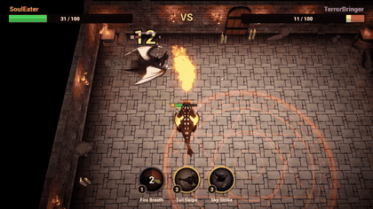</td>
    <td>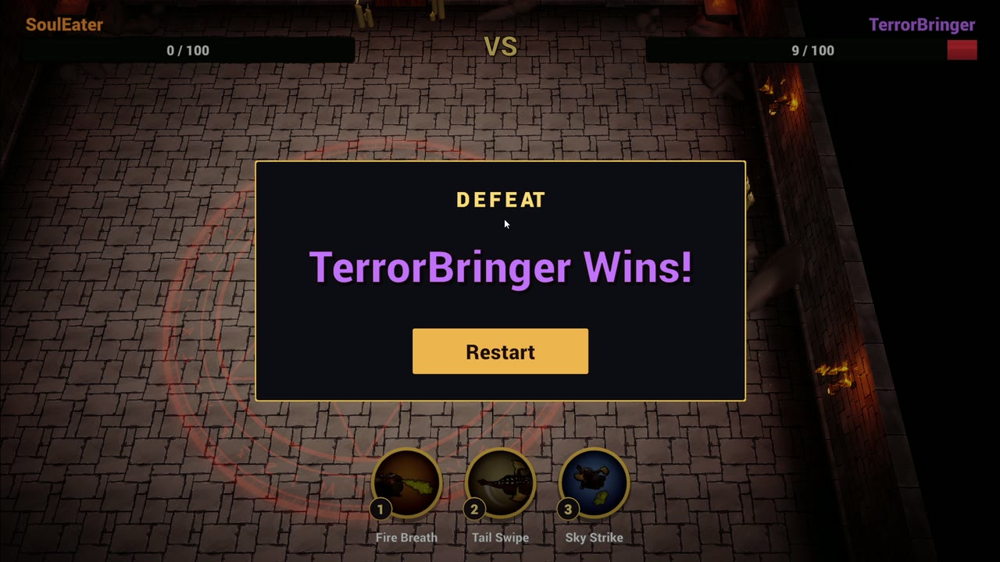</td>
  </tr>
</table>

### Main Menu

- The game opens on a close-up of SoulEater inside the arena, with Play, Options and Quit. The menu lives in the
  Battle scene, so there is no loading cut between the menu and the fight.
- The close-up has a slow handheld drift, mouse parallax, a bokeh depth of field volume and two menu-only lights.
- **Play:** SoulEater roars, the camera pushes in and shakes, then flies up and over the dragon along a curve and
  lands exactly on the gameplay camera pose before the FIGHT banner plays (`MenuCamera`).
- **Options:** master, music and effects volume, screen shake and fullscreen. Settings are saved with PlayerPrefs.
- Restarting from the Winner Screen skips the menu and goes straight back into the fight.

<p align="center">
  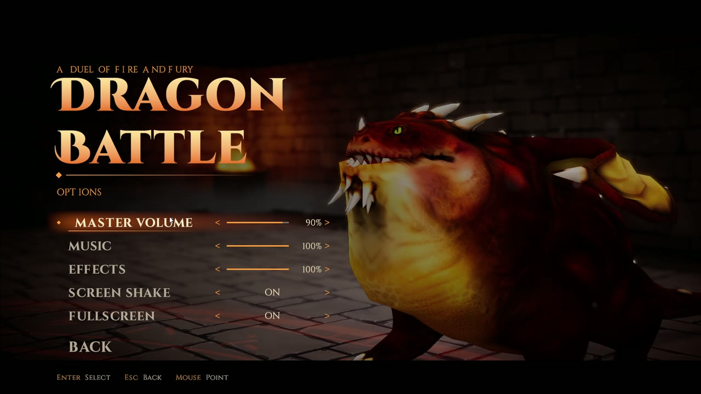
  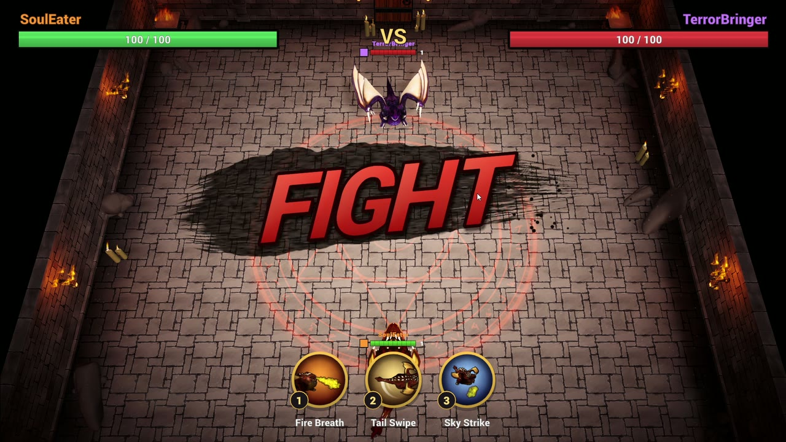
  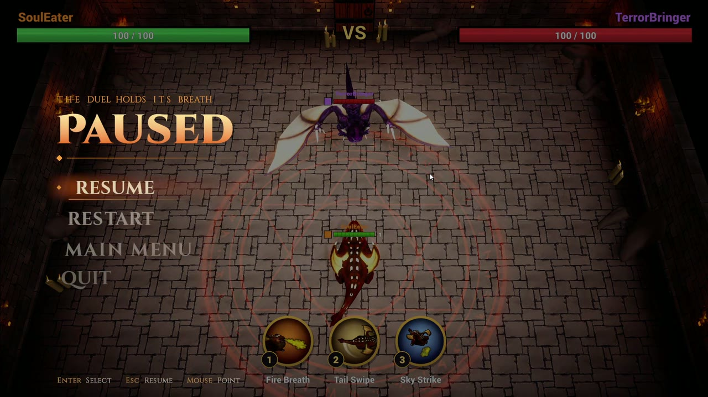
</p>

### Camera and arena

- The camera is angled overhead at 55 degrees (TFT / Dota Underlords style). It follows the midpoint of the two
  dragons and zooms out as they move apart, so both stay in view.
- The arena is a walled dungeon floor with invisible boundary colliders (including a ceiling for the flying attack),
  so neither dragon can leave the play area.
- Lighting: a directional light with soft shadows plus torch point lights and flame particles along the walls.

## Project structure

All project code and content lives in `Assets/_Project`. Third-party packs are kept in their own folders, unchanged
apart from converting their materials to URP. The README screenshots and GIFs live in `Docs/Media`, outside `Assets`,
so Unity does not import them.

```
Assets/_Project
  Animations/    Shared dragon Animator Controller and the TerrorBringer override controller
  Data/          AbilityData ScriptableObjects (damage, cooldown, range, VFX, SFX, icon)
  Input/         Input System actions (DragonControls)
  Materials/     Physics material for the dragons
  Prefabs/       PlayerDragon, EnemyDragon, VFX variants and the damage popup
  Scenes/        Battle.unity
  Scripts/
    AI/          EnemyAI
    Combat/      Health, Ability, AbilityCaster, AbilityData, HitFeedback, Abilities/ (Fire, Tail, Fly)
    Core/        GameManager, CameraController, DragonMotor, DragonAnimator, DragonIdentity, EffectSpawner
    Player/      PlayerController
    UI/          HealthBar, AbilitySlotUI, DamagePopup, DamagePopupSpawner, WinnerScreen
  UI/            Ability icons, UI sprites, fonts and UI materials
```

Design notes:

- **Shared components for both dragons.** `DragonMotor` (Rigidbody movement and knockback), `DragonAnimator`,
  `Health` and `AbilityCaster` sit on both dragons. The only difference is the "brain": `PlayerController` reads
  input and `EnemyAI` makes decisions. This is why the AI automatically respects the same cooldowns.
- **Data-driven abilities.** Each ability is an `AbilityData` asset plus a small `Ability` subclass for its
  behaviour, so balancing is done in the Inspector without touching code.
- **Events instead of polling.** `Health` raises `OnDamaged` and `OnDied`. The health bars, damage popups, hit flash,
  animator and `GameManager` all listen to those events and do not know about each other.

## Asset sources

All third-party assets are free assets from the Unity Asset Store.

| Asset | Publisher | Used for | Link |
|---|---|---|---|
| Dragon for Boss Monster: HP (Four Evil Dragons Pack HP) | Dungeon Mason | Both dragon models and animations | https://assetstore.unity.com/packages/3d/characters/creatures/four-evil-dragons-pack-hp-79398 |
| Stylized Hand Painted Dungeon (Free) | L2S Arts | Arena floor, walls, pillars and torches | https://assetstore.unity.com/packages/3d/environments/stylized-hand-painted-dungeon-free-173934 |
| Particle Pack | Unity Technologies | Fire breath, fireball, explosions, dust and hit effects | https://assetstore.unity.com/packages/vfx/particles/particle-pack-127325 |
| RPG Essentials Sound Effects - FREE! | leohpaz | Attack, impact, wind and landing sounds | https://assetstore.unity.com/packages/audio/sound-fx/rpg-essentials-sound-effects-free-227708 |

Other:

- **Roboto Black** font (Google, Apache License 2.0), used for the HUD text.
- **Cinzel** and **Cinzel Decorative** fonts (Natanael Gama, SIL Open Font License 1.1, license in
  `Assets/_Project/UI/Fonts/Cinzel-OFL.txt`), used for the Main Menu.
- The three ability icons were rendered in-engine from the SoulEater model and its own animations, so they are
  original to this project.

## Building

1. Open the project in Unity 6000.3.24f1.
2. **File > Build Profiles**, select **Windows**, and make sure `Assets/_Project/Scenes/Battle.unity` is the only
   scene in the list.
3. Click **Build** and choose an output folder outside `Assets` (for example `Builds/`, which is git-ignored).

## AI Usage Note

**Tools used**

- **Claude Code** (Anthropic's Claude, in the terminal) as the main assistant.
- **MCP for Unity** (CoplayDev), which connects Claude Code to the running Unity Editor. Through it the assistant
  could create GameObjects, edit prefabs and components, enter Play mode, read the console, take Game view
  screenshots and run the profiler.

**What I used them for**

- **Planning:** turning the brief into eight phases (setup, arena, dragons, controls, abilities, AI, UI, polish),
  and checking which of my downloaded assets covered each requirement. For example, only SoulEater has a real tail
  animation, so it became the player dragon.
- **Coding:** writing the C# scripts phase by phase. I reviewed each script and asked for changes where the
  structure did not suit me, for example keeping one shared `AbilityCaster` for both dragons so the AI could not
  cheat on cooldowns.
- **Editor work:** building the arena, prefabs, animator controller and HUD through MCP, and converting the
  Built-in materials of the asset packs to URP.
- **Debugging and testing:** after each phase the assistant ran the game in Play mode, drove the dragons with a
  temporary editor hook, read the console and checked screenshots. Keyboard feel was checked by playing the game.

**One thing the AI got wrong and how it was fixed**

The first version of the enemy AI used Sky Strike almost all the time. The AI's logic picked Sky Strike whenever it
was ready and the player was out of Fire range, but it did not account for how long the attack takes: the full
take off, fly and land sequence lasts about 9.5 s against a 10 s cooldown. In a test fight the enemy was in the air
for 22 of the first 33 seconds, which made the fight dull and unfair. I found this by watching a test fight and
measuring the time in the air. The fix was a minimum rest time on the ground (8 s since the last landing) before the
AI may use Sky Strike again at mid range, plus a chance to commit to closing in for a Tail Swipe, which it had
otherwise almost never used. After the change the enemy used all three abilities in a varied pattern.

A second, smaller example: the Winner Screen panel came out brown instead of dark blue. The AI had made the panel
slightly transparent and given it a gold outline. In a Linear colour space project, the gold outline copies drawn
behind the panel showed through and warmed its colour. Making the panel fully opaque fixed it.

**How the tools helped**

- The assistant handled the repetitive editor work (placing 121 floor tiles, wiring UI references, creating
  prefab variants), which left more of the 72 hours for gameplay and feel.
- Automated Play mode tests with screenshots caught problems early, like the Sky Strike overuse, a title that did
  not fit the Winner Screen, and damage numbers showing overkill damage.
- I stayed in control of the design: every script was reviewed, and all tuning values are exposed in the Inspector
  so balance can be adjusted without code changes.
